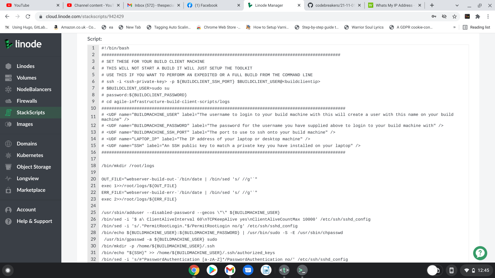
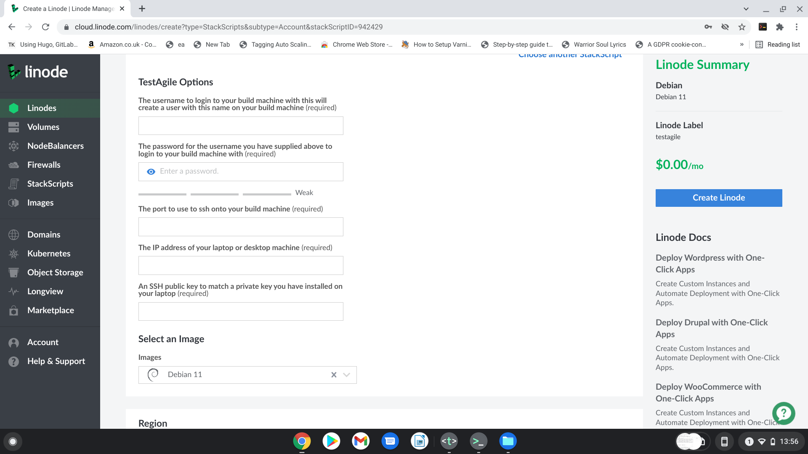
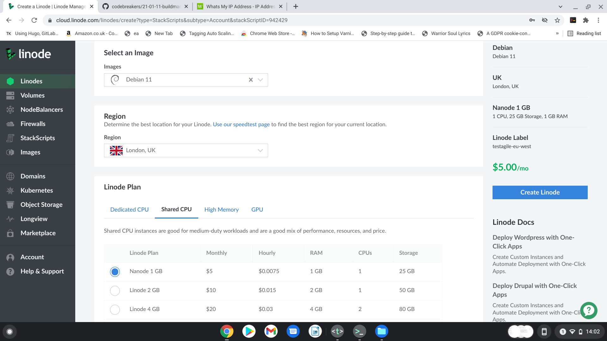
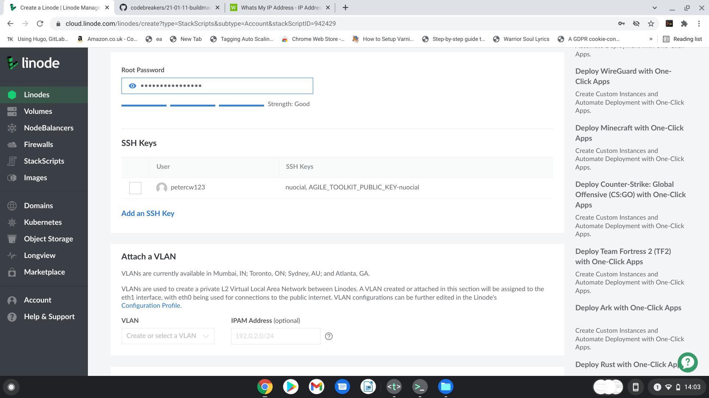
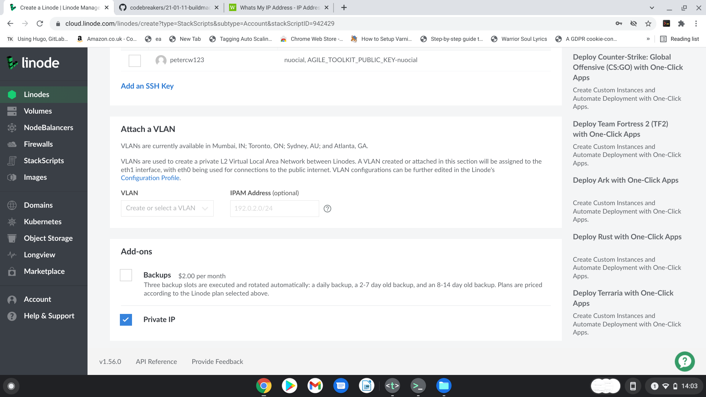
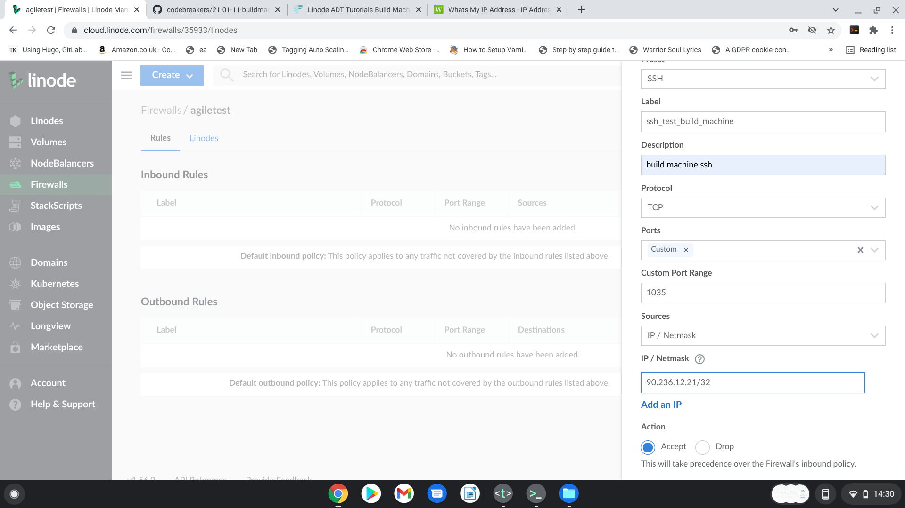
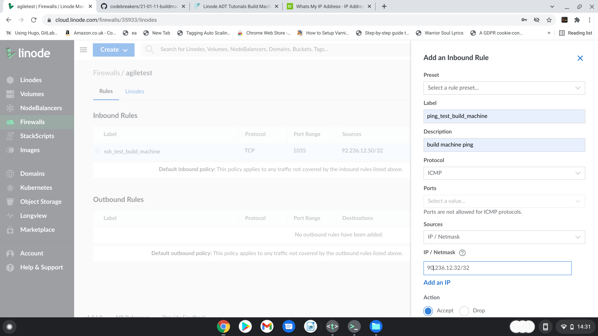
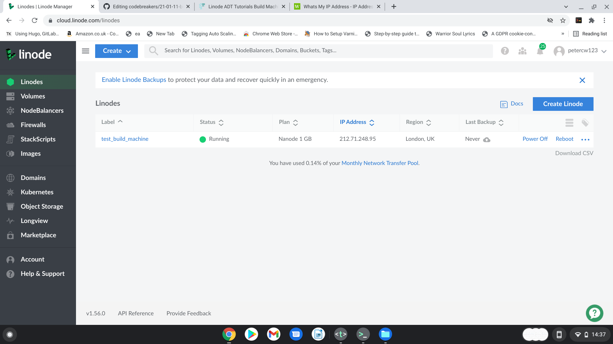

### PRE BUILD PREPARATIONS FOR EXPEDITED BUILDS:

Before performing an expedited or full build, you need to set up a build machine. The way you do this for Linode is as follows:

----------------

1) If you don't have an SSH key pair or if you want a specific SSH key pair for your builds, issue the following command:

&nbsp;  
&nbsp; 
>     /usr/bin/ssh-keygen -t rsa 

&nbsp;  
&nbsp; 

Your key will be saved to the indicated file, for example, **/root/.ssh/id_rsa** your path might be different such as **/home/bob/.ssh/id_rsa**
	 
Issue the command (for example)

&nbsp;  
&nbsp; 	 
>     /bin/cat /root/.ssh/id_rsa.pub - this will be your <ssh-public-key-substance>

&nbsp;  
&nbsp; 	 
This will give you your **public** key which you need later so, take a copy of the output that is printed to the screen.

&nbsp;  
&nbsp;  
&nbsp;  

--------------------
	
2) Take a copy of the script: [Initial Script](../../../templatedconfigurations/templateoverrides/OverrideScriptLinode.sh) and make a stack script out of it which will look like:
  
   

	
&nbsp;  
&nbsp;  
&nbsp; 

------------------
	
3) If you want to deploy a machine (debian of ubuntu) using the stack script that you made in 2, you can see the following variables in the raw script

&nbsp;  
&nbsp;
	
>     BUILDMACHINE_USER=""  (for example wintersys-projects)
>     BUILDMACHINE_PASSWORD=""  (Make sure the password is complex enough to satisfy any strength checks that the OS performs)
>     BUILDMACHINE_SSH_PORT="" (for example 1056)
>     LAPTOP_IP=""   (www.whatsmyip.com)
	
>     SSH=\"\"  (the public key that you installed on your laptop as a key pair in 1)
	
You need to now deploy a linode using the Stackscript that you constructed in 2 and populate the variables you just reviewd in the Stackscript you are building from which will look something like:
	

	
You then need to set various options for the linode you are deploying. 
	
Select a machine image to build from (Ubuntu 20:04 and up or Debian 11 and up), a region and a machine size (most probably quite a small machine)

	
Then enter (and record) a root password, make sure it is complex enough to satisfy any strength checks built into the OS
	
 

Then switch on private networking
	
 

	
4)  If you are sure that all your variables are set correctly in the stack script you have created, you can now actually deploy a Linode using it and it will install the agile deployment toolkit on it.  

&nbsp;  
&nbsp;  
&nbsp; 

--------------- 
	
6) Add a firewall to your new build machine linode cutting off all but the SSH port you set above and Pinging from the ip address of your laptop. In other words, the only machine which has any access to your build machine linode is your own laptop through ssh and ping.
	
For SSH, do as follows for the ip address of your laptop:  

 

	
For Ping, do as follows for the ip address of your laptop:  

  
	
--------------------

5) You can access your build machine from your laptop now as follows:
	
&nbsp;  
&nbsp; 
	
Discover what the machine's IP address is by looking at the Linode GUI system for the IP address of the build machine - in this case: \<buildmachineip\> = 212.71.248.95
	
 

&nbsp;  
&nbsp;
	
Now on your laptop issue the command:

&nbsp;  
&nbsp;

>     ssh -i /root/.ssh/id_rsa -p ${BUILDCLIENT_SSH_PORT} $BUILDCLIENT_USER@<buildmachineip>

&nbsp;  
&nbsp;
	
or yours might be:

&nbsp;  
&nbsp;
	
>     ssh -i /home/${username}/.ssh/id_rsa -p ${BUILDCLIENT_SSH_PORT} $BUILDCLIENT_USER@<buildmachineip>	

&nbsp;  
&nbsp;

Once logged in to your build machine

&nbsp;  
&nbsp;

>     sudo su 
>     [sudo] password for wintersys-projects:

&nbsp;  
&nbsp;

And then enter your build machine password (this is the password you entered into the Stack Script when you were configuring it above)

&nbsp;  
&nbsp; 	

>     ${BUILDMACHINE_PASSWORD}

&nbsp;  
&nbsp;		
	
On the command line of your laptop it looks like the following:
	
 

		
--------------------------------------
	
 
